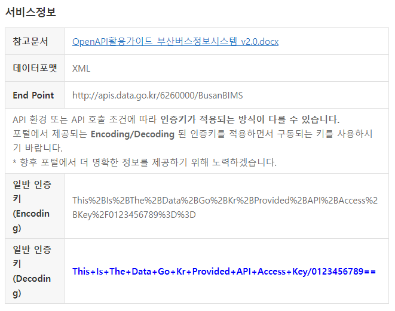

# BUSANBIMSLIB
  부산광역시 버스정보시스템 .NET용 라이브러리 

## 개요
**BusanBimsLib**는 [부산광역시 버스정보시스템 API](https://www.data.go.kr/data/15092750/openapi.do)를 .NET에서 편리하게 쓸 수 있는 Wrapper 라이브러리입니다.

## 다운로드 &amp; 설치
**BusanBimsLib**는 


### .NET CLI로 설치
```bash
dotnet add package BusanBimsLib 
```

### Package Manager CLI로 설치
```pwsh
Install-Package BusanBimsLib 
```

### PackageReference
```xml
<PackageReference Include="BusanBimsLib" Version="1.0.0" />
```

### NuGet 패키지 직접 다운로드
https://nuget.org/packages/BusanBimsLib

## 사용방법
**BusanBimsLib**의 모든 기능은 `BusanBimsLib.BusanBimsClient` 클래스에서 동작합니다.

### API 클라이언트 생성하기

> **Warning**  
> API 클라이언트 인스턴스(`BusanBimsClient`)를 생성할 때, [공공데이터포털](https://data.go.kr/)에서 발급받은 인증키 중 **Decoding** 인증키를 사용하여야 합니다.  
> (Encoding 인증키를 사용할 경우 인증키를 제대로 인식하지 못할 수도 있습니다.)  
> 
>   
> **파란색 강조 표시된 부분을 사용**

* C# (>= 9.0 &amp; Top-level statement 사용 시)
```csharp
using BusanBimsLib;

BusanBimsClient bis = new("DECODING_ACCESS_KEY"); 

...

```

* C# (< 9.0, >= 9.0 &amp; Top-level statement 미사용 시)
```csharp
using BusanBimsLib;

namespace BusanBimsLibExample 
{
    public class Program 
    {
        public static async Task Main(string[] args)
        {
            BusanBimsClient bis = new BusanBimsClient("DECODING_ACCESS_KEY"); 

            ......
        }
    }
}

```

### 버스정류장 검색하기

```csharp
......
// 해당 키워드가 이름에 포함된 버스정류장 데이터를 가져옵니다. 
string kwd = "서면"

BusStopListResponseData busStopList = await bis.GetBusStopList(kwd);

Console.WriteLine($"버스정류장 '{kwd}' 검색결과: {busStopList.Count}개 중 {busStopList.ItemsPerPage}개\n");

foreach(var item in busStopList)
{
    Console.WriteLine($"버스정류장 이름: {item.BusStopName}");
    Console.WriteLine($"버스정류장 ID : {item.BusStopID}");
    Console.WriteLine($"버스정류장 종류: {item.BusStopKind}");
    Console.WriteLine($"버스정류장 위치: {item.Location}");
    Console.WriteLine();
}

Console.WriteLine($"페이지 {busStopList.Page} / {busStopList.TotalPages}");
......
```
#### 실행 결과:
```
버스정류장 '서면' 검색결과: 12개 중 10개

버스정류장 이름: 서면역.롯데호텔백화점
버스정류장 ID : 164630302
버스정류장 종류: 일반
버스정류장 위치: 35.157735, 129.055546

버스정류장 이름: 서면복개로
버스정류장 ID : 164650201
버스정류장 종류: 일반
버스정류장 위치: 35.153564, 129.057776

......

버스정류장 이름: 서면교차로
버스정류장 ID : 506980000
버스정류장 종류: 일반
버스정류장 위치: 35.157888797896, 129.061751007201

페이지 1 / 2

```

### 버스노선 검색하기
> **Note**  
> 마을버스 검색시 각 구/군의 **공식 행정구역명 전체**를 사용하여야 합니다. 약칭을 사용하거나 행정구역 단위를 생략하는 경우 검색되지 않습니다.  
> 예: 금정3 -> **금정구3**, 기장8 -> **기장군8**, 진구6-1 -> **부산진구6-1**

```csharp
...
string kwd = "80";

BusInfoResponseData busInfo = await bis.GetBusInfo("80");

Console.WriteLine("버스노선 '{kwd}' 검색결과: {busInfo.Count}개");

foreach(BusInfo item in busInfo)
{
    Console.WriteLine($"노선번호: {item.BusName}");
    Console.WriteLine($"종류: {item.BusKind}");
    Console.WriteLine($"기점: {item.BeginingAt}");
    Console.WriteLine($"종점: {item.EndingAt}");
    Console.WriteLine($"첫차: {item.FirstBus:HH:mm}");
    Console.WriteLine($"막차: {item.LastBus:HH:mm}");
    Console.WriteLine($"배차간격: {item.Interval.TotalMinutes}분");
    Console.WriteLine();
}
...
```
#### 실행 결과:
```
버스노선 '80' 검색결과: 2개

노선번호: 180
종류: 일반버스
기점: 청강리공영차고지
종점: 고원3차아파트
첫차: 05:00
막차: 22:15
배차간격: 45분

노선번호: 80
종류: 일반버스
기점: 금정공영차고지
종점: 부산진시장
첫차: 04:50
막차: 22:00
배차간격: 7분

```
### 버스노선 정류장 리스트 가져오기
> **Warning**  
> `busID` 파라메터에 **실제 노선번호**(`BusName`, 예: `"80"`, `"강서구7-2"`)를 전달하면 작동하지 않습니다. 
> 해당 파라메터에는 반드시 [버스노선 검색하기](#버스노선-검색하기) 에서 가져온 `BusID`(예: `"5200080000"`)를 사용하여야 합니다.

> **Note**  
> 이 작업은 실행 시간이 오래 걸릴 수 있습니다.

```csharp
...
string busID = "5200051000";

BusRouteResponseData busRoute = await bis.GetBusRoute(busID);

foreach(BusRouteNode item in busRoute)
{
    StringBuilder sb = new StringBuilder();
    sb.Append($"{item.Order}. {item.BusStopName}");
    if(item.CarPlate != null)
    {
        sb.Append('[');
        if(item?.IsLowPlateBus) sb.Append("저상 ");
        sb.Append("{item.CarPlate}]");
    }
    if(item.IsReturningPoint) sb.Append("(종점)")
    
    Console.WriteLine(sb);
}
...
```
#### 실행 결과:
```
1. 금정공영차고지[70자5473]
2. 부산종합터미널.노포역
3. 노포삼거리
4. 범어사입구
......
65. 우암뉴서울아파트
66. 우암자유아파트[70자5446](종점)
67. 동천초등학교[저상 70자5427]
68. 남광시장
......
126. 범어사입구
127. 노포삼거리
128. 부산종합터미널.노포역
129. 금정공영차고지[저상 70자5474]

```

### 특정 정류장 버스 도착정보 가져오기
```csharp
...
string busStopID = "174130201";

BusServiceInfoResponseData busServiceInfo = await bis.GetBusServiceInfo();

foreach(BusServiceInfo item in busServiceInfo)
{
    Console.WriteLine($"{item.BusKind.Replace("버스", "")} {item.BusName}");

    if(item.ServiceInfo.Count > 0)
    {
        foreach(BusServiceDetail detail in item)
        {
            StringBuilder sb = new StringBuilder();
            sb.Append($"{item.LeftStops}전 / {item.LeftTime.TotalMinutes}분 후 [");
            if(item.IsLowPlate) sb.Append("저상 ");
            sb.Append($"{sb.BusPlate}");
            if(item.LeftSeats != null) sb.Append($" {item.LeftSeats}석");
            sb.Append(']');
            Console.WriteLine(sb);
        }
    }
    else Console.WriteLine("운행 준비중");
    
    Console.WriteLine();
}
...
```
실행 결과:
```
급행 1002 
6전 / 18분 후 [1901]

일반 148
운행 준비중

일반 50
3전 / 6분 후 [저상 2554]
14전 / 21분 후 [저상 2533]

```


## 라이센스
**BusanBimsLib**는 [GNU LGPL 2.1 라이센스](https://www.olis.or.kr/license/Detailselect.do?lId=1005)에 따라 자유롭게 이용, 복제, 수정, 재배포가 가능합니다.
수정 후 재배포하는 경우 소스코드 제공 요청에 반드시 응하여야 하며, 동일한 라이선스를 적용하여 배포하여야 합니다.
원작자는 본 라이브러리 및 소스코드를 사용함으로써 발생하는 일체의 문제에 대하여 책임지지 않습니다.

## 기여
