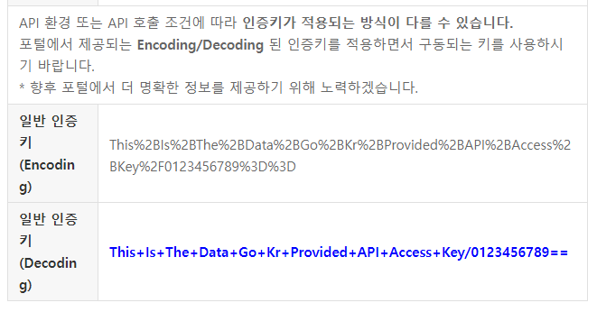

# BUSANBIMSLIB
  부산광역시 버스정보시스템 .NET용 라이브러리 

## 개요
**BusanBimsLib**는 [부산광역시 버스정보시스템 API](https://www.data.go.kr/data/15092750/openapi.do)를 .NET에서 편리하게 쓸 수 있는 Wrapper 라이브러리입니다.

## 다운로드 &amp; 설치
**BusanBimsLib**는 


### .NET CLI로 설치
```bash
dotnet add package BusanBimsLib 
```

### Package Manager CLI로 설치
```pwsh
Install-Package BusanBimsLib 
```

### PackageReference
```xml
<PackageReference Include="BusanBimsLib" Version="1.0.0" />
```

### NuGet 패키지 직접 다운로드
https://nuget.org/packages/BusanBimsLib

## 사용방법
**BusanBimsLib**의 모든 기능은 `BusanBimsLib.BusanBimsClient` 클래스에서 동작합니다.

### API 클라이언트 생성하기

> **Warning**  
> API 클라이언트 인스턴스(`BusanBimsClient`)를 생성할 때, [공공데이터포털](https://data.go.kr/)에서 발급받은 인증키 중 **Decoding** 인증키를 사용하여야 합니다.  
> (Encoding 인증키를 사용할 경우 인증키를 제대로 인식하지 못할 수도 있습니다.)  
> 
>   
> 파란색 강조 표시된 부분을 사용

* C# (>= 9.0 &amp; Top-level statement 사용 시)
```csharp
using BusanBimsLib;

BusanBimsClient bis = new("DECODING_ACCESS_KEY"); 

...

```

* C# (< 9.0, >= 9.0 &amp; Top-level statement 미사용 시)
```csharp
using BusanBimsLib;

namespace BusanBimsLibExample 
{
	public class Program 
	{
		public static void Main(string[] args)
		{
			BusanBimsClient bis = new("DECODING_ACCESS_KEY"); 

			...
		}
	}
}

```

### 버스정류장 검색하기

```csharp
......
// 해당 키워드가 이름에 포함된 버스정류장 데이터를 가져옵니다. 
BusStopListResponseData busStopList = await bis.GetBusStopList("서면");

Console.WriteLine($"검색결과: {busStopList.Count}개\n");

foreach(var item in busStopList)
{
	Console.WriteLine($"버스정류장 이름: {item.BusStopName}");
	Console.WriteLine($"버스정류장 ID : {item.BusStopID}");
	Console.WriteLine($"버스정류장 종류: {item.BusStopKind}");
	Console.WriteLine($"버스정류장 위치: {item.Location}");
	Console.WriteLine();
}

......
```
실행 결과:
```
검색결과: 12개

버스정류장 이름: 서면역.롯데호텔백화점
버스정류장 ID : 164630302
버스정류장 종류: 일반
버스정류장 위치: 35.157735, 129.055546

버스정류장 이름: 서면복개로
버스정류장 ID : 164650201
버스정류장 종류: 일반
버스정류장 위치: 35.153564, 129.057776

......

버스정류장 이름: 서면교차로
버스정류장 ID : 506980000
버스정류장 종류: 일반
버스정류장 위치: 35.157888797896, 129.061751007201

```

### 버스노선 검색하기
```csharp
...

BusInfoResponseData busInfo = await bis.GetBusInfo("80");


```
출력 결과:
```

```

### 버스노선 정류장 리스트 가져오기
```csharp

```
출력 결과:
```
```

### 특정 정류장 버스 운행정보 가져오기
```csharp

```
출력 결과:
```
```


## 라이센스
**BusanBimsLib**는 [GNU LGPL 2.1 라이센스](https://www.olis.or.kr/license/Detailselect.do?lId=1005)에 따라 자유롭게 이용, 복제, 수정, 재배포가 가능합니다.
수정 후 재배포하는 경우 소스코드 제공 요청에 반드시 응하여야 하며, 동일한 라이선스를 적용하여 배포하여야 합니다.
원작자는 본 라이브러리 및 소스코드를 사용함으로써 발생하는 일체의 문제에 대하여 책임지지 않습니다.

## 기여
